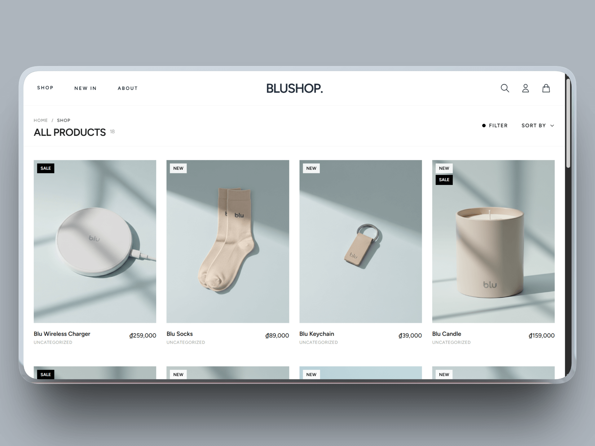
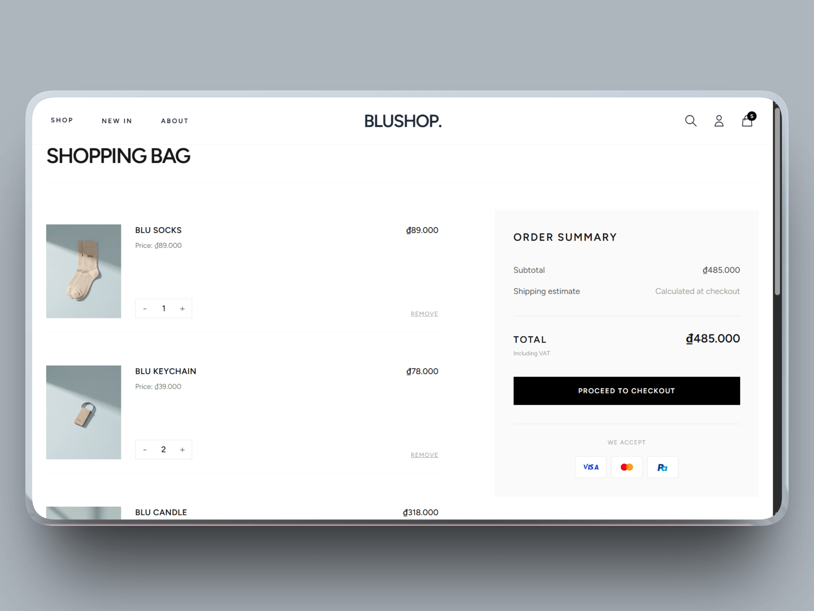
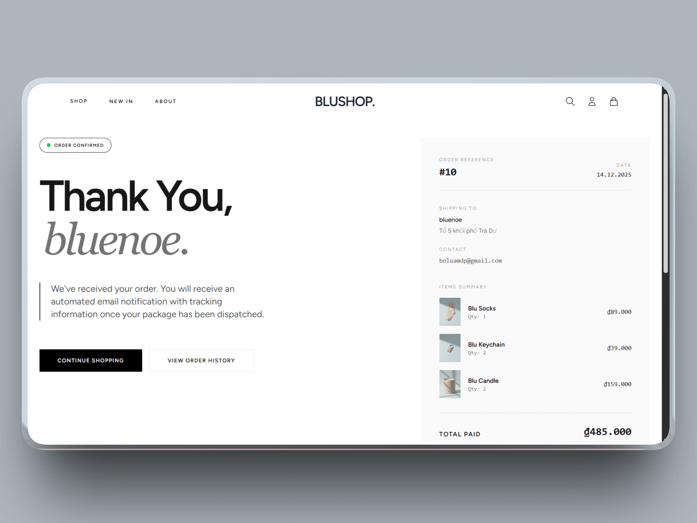
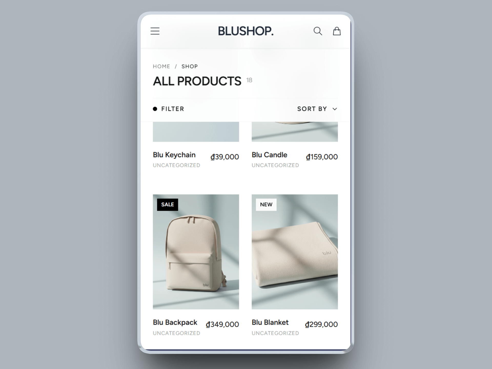

# BluShop (Laravel 11) — Mini E-commerce

A Laravel mini e-commerce project designed for students. It covers fundamental concepts like product display, cart management using sessions, user authentication with Breeze, a simulated checkout process, and a contact form that saves messages to the database.

**License:** MIT

---

## ✨ Features

-   [x] **Home Page:** Displays a grid of products with images and prices. (Day 2)
-   [x] **Product Detail:** View a single product at `/product/{id}`. (Day 3)
-   [x] **Shopping Cart (Session-based):** Add, update, remove items, and clear the cart. (Day 3)
-   [x] **Authentication:** User registration, login, and logout powered by Laravel Breeze (Blade). (Day 4)
-   [x] **Checkout:** A simple, auth-protected checkout process that shows an order summary and a success page, then clears the cart. (Day 4)
-   [x] **Contact Form:** A contact page with a form that saves messages directly to the `contact_messages` table and shows a success flash message. (Day 5)
-   [x] **Basic UI:** A clean navigation bar and layout using Bootstrap 5 (CDN).

---

## 🛠️ Tech Stack

-   **Backend:** Laravel 11, PHP 8.2+
-   **Database:** MySQL / MariaDB
-   **Frontend:** Blade, Vite, Bootstrap 5 (CDN)
-   **Dev Tools:** Node.js 20+

---

## 🚀 Setup and Run

1.  **Clone the repository:**

    ```bash
    git clone https://github.com/your-username/blushop-laravel.git
    cd blushop-laravel
    ```

2.  **Install PHP dependencies:**

    ```bash
    composer install
    ```

3.  **Set up your environment:**

    -   Copy the example environment file:
        ```bash
        cp .env.example .env
        ```
    -   Generate the application key:
        ```bash
        php artisan key:generate
        ```

4.  **Configure the database:**

    -   Create a new database in MySQL/MariaDB (e.g., `blushop_db`).
    -   Update the `.env` file with your database credentials:
        ```ini
        DB_CONNECTION=mysql
        DB_HOST=127.0.0.1
        DB_PORT=3306
        DB_DATABASE=blushop_db
        DB_USERNAME=root
        DB_PASSWORD=your_password_here (mine is root)
        ```

5.  **Run database migrations:**

    ```bash
    php artisan migrate
    ```

6.  **(Optional) Seed demo products:**

    ```bash
    php artisan db:seed --class=Database\Seeders\ProductSeeder
    ```

7.  **Install frontend dependencies (for Breeze):**

    ```bash
    npm install
    ```

8.  **Run the development servers:**
    -   Start the Vite development server:
        ```bash
        npm run dev
        ```
    -   In a new terminal, start the PHP development server:
        ```bash
        php artisan serve
        ```

The application will be available at `http://127.0.0.1:8002`.

---

## 🗃️ Database Schema

-   **`products`**

    -   `id` (PK)
    -   `name` (string)
    -   `description` (text, nullable)
    -   `price` (decimal 8,2)
    -   `image` (string) - _Stores path to image file in `public/images`_
    -   `created_at`, `updated_at`

-   **`contact_messages`**

    -   `id` (PK)
    -   `name` (string)
    -   `email` (string)
    -   `message` (text)
    -   `created_at`

-   **`users`** (Managed by Laravel Breeze)
    -   `id`, `name`, `email`, `password`, etc.

---

## 🗺️ Key Routes

| Method | Path                  | Controller@Action          | Middleware | Description                     |
| :----- | :-------------------- | :------------------------- | :--------- | :------------------------------ |
| `GET`  | `/`                   | `ProductController@index`  | `web`      | Show product list (Home)        |
| `GET`  | `/product/{id}`       | `ProductController@show`   | `web`      | Show single product detail      |
| `GET`  | `/cart`               | `CartController@index`     | `web`      | Show cart page                  |
| `POST` | `/cart/add/{id}`      | `CartController@add`       | `web`      | Add product to cart             |
| `POST` | `/cart/update/{id}`   | `CartController@update`    | `web`      | Update product quantity in cart |
| `POST` | `/cart/remove/{id}`   | `CartController@remove`    | `web`      | Remove product from cart        |
| `POST` | `/cart/clear`         | `CartController@clear`     | `web`      | Clear all items from cart       |
| `GET`  | `/checkout`           | `CheckoutController@index` | `auth`     | Show checkout summary page      |
| `POST` | `/checkout/place`     | `CheckoutController@place` | `auth`     | "Place" the order               |
| `GET`  | `/contact`            | `ContactController@index`  | `web`      | Show contact form               |
| `POST` | `/contact`            | `ContactController@send`   | `web`      | Submit contact message          |
| `GET`  | `/login`, `/register` | (Breeze)                   | `guest`    | Auth pages                      |
| `POST` | `/logout`             | (Breeze)                   | `auth`     | Logout user                     |

---

## ✅ Code Quality & Notes

-   **Input Validation:** All incoming requests are validated (e.g., cart quantity must be >= 1, contact fields have min length).
-   **Secure:** `findOrFail` is used to prevent errors on missing products. CSRF protection is enabled on all forms. Server-side calculations are used for cart totals.
-   **Good UX:** Flash messages provide feedback. The cart badge updates with the item count.
-   **Demo Images:** Product images are located in `public/images`.

---

## 🚀 Future Roadmap & Scalability Plans

While the current MVP (Minimum Viable Product) meets all functional requirements, the following technical improvements are planned to scale the application for production:

### 🔧 Architecture & Performance

-   [ ] **Caching Strategy:** Implement **Redis** to handle session management and cache heavy database queries (e.g., product lists) for faster load times.

-   [ ] **Asynchronous Processing:** Utilize **Laravel Queues** (via Redis/Horizon) to handle email sending (Contact Form) in the background, preventing UI blocking.

-   [ ] **API Development:** Expose RESTful API endpoints with Sanctum authentication to support a potential mobile app (Flutter/React Native) in the future.

### 💳 Payments & Integrations

-   [ ] **Payment Gateway:** Replace the simulated checkout with real-world integration using **Stripe** or **VNPay** (Sandbox mode) handling Webhooks for order status updates.

-   [ ] **Filesystem Abstraction:** Migrate image storage from local disk (`public/`) to cloud storage (**AWS S3** or **MinIO**) to support stateless deployment.

### 🛠️ DevOps & Quality Assurance

-   [ ] **Containerization:** Fully Dockerize the application using **Docker Compose** (Nginx, PHP, MySQL, Redis) to ensure environment consistency.

-   [ ] **Automated Testing:** Increase test coverage using **Pest PHP** for Feature and Unit tests to prevent regressions during refactoring.

-   [ ] **CI/CD Pipeline:** Set up GitHub Actions to automatically run tests (`php artisan test`) and linting (`Laravel Pint`) on every push.

---

## 📸 Project Screenshots

<div align="center">
  <table>
    <tr>
      <td width="50%" align="center">
        <h3>🏠 Homepage / Product Grid</h3>
        <p>Minimalist design with dynamic product loading.</p>
        
      </td>
      <td width="50%" align="center">
        <h3>🛒 Shopping Cart</h3>
        <p>Session-based cart management & calculations.</p>
        
      </td>
    </tr>
    <tr>
      <td width="50%" align="center">
        <h3>💳 Checkout Process</h3>
        <p>Streamlined checkout flow with mock payment integration.</p>
        
      </td>
      <td width="50%" align="center">
        <h3>📱 Responsive / Success</h3>
        <p>Fully responsive UI for mobile devices.</p>
        
      </td>
    </tr>
  </table>
</div>
