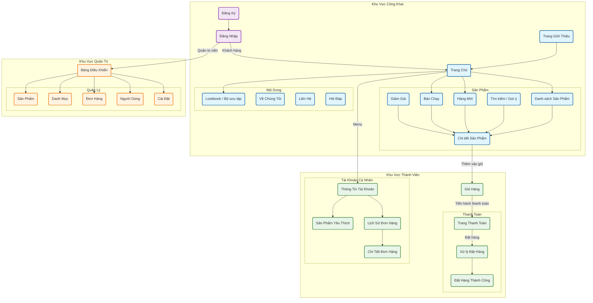

# Sitemap - BluShop-Laravel

Biểu đồ cấu trúc hệ thống website (Sitemap) được tạo tự động dựa trên phân tích source code (`routes/web.php`).

## Ghi chú về luồng dữ liệu (Notes)

1. **Khách vãng lai (Public):**
   - Có thể xem sản phẩm, thêm vào giỏ hàng mà không cần đăng nhập (Session based cart).
   - Tuy nhiên, để bình luận (`ReviewController`) hoặc thanh toán (tùy cấu hình), có thể yêu cầu đăng nhập.

2. **Thành viên (Customer):**
   - Quản lý danh sách yêu thích (`WishlistController`).
   - Xem lại lịch sử đơn hàng (`OrderController`).
   - Quản lý địa chỉ giao hàng trong trang hồ sơ (`ProfileController`).

3. **Quản trị viên (Admin):**
   - Truy cập qua `/admin`.
   - Middleware `is_admin` bảo vệ toàn bộ khu vực này.
   - Quản lý toàn bộ tài nguyên hệ thống (Sản phẩm, Đơn hàng, v.v.).

---
*Generated by Antigravity*
